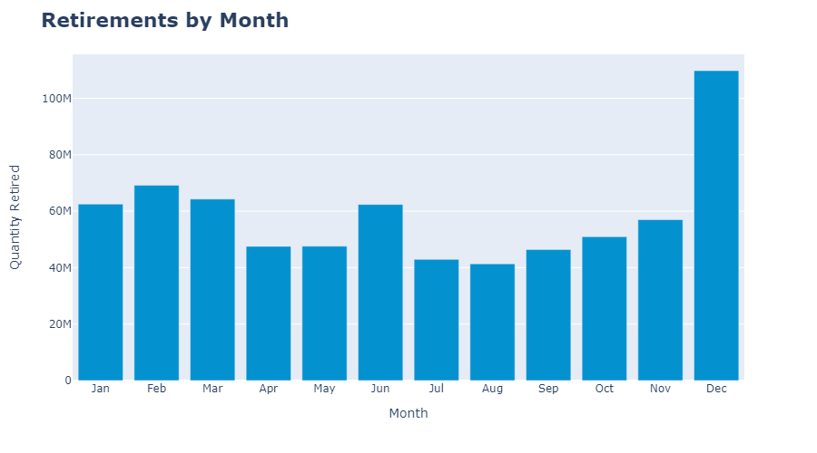
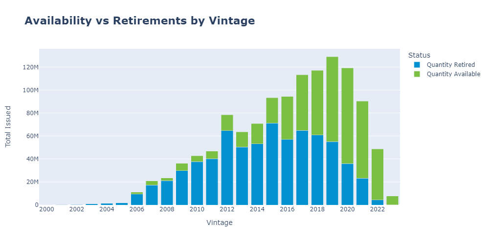
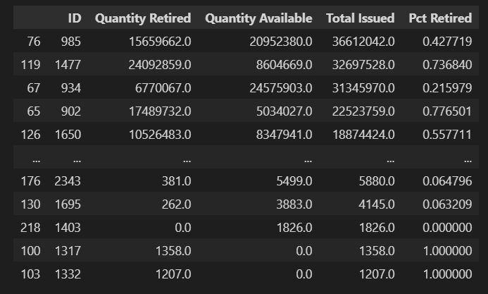

# Exploratory Data Analysis - Carbon Credits

## Project Description

### What are Carbon Credits?

First of all, I'll start by explaining what Carbon Credits are.

Carbon credits are tradable certificates representing one ton of carbon dioxide (CO2). They are crucial in mitigating climate change by incentivizing emission reductions and supporting sustainable practices. Organizations earn carbon credits by reducing emissions or sequestering CO2 from the atmosphere below a predetermined baseline, which can then be sold or traded to other entities to offset their emissions. This system helps encourage investment in cleaner technologies and practices while providing a financial incentive for emission reductions.

In this project, I'll focus on carbon credits from a specific registry, Verra, the largest one in the voluntary carbon market environment. In this dynamic, the organizations responsible for those reductions or sequestration are independent and might or might not be funded by polluting companies.

Their goal is to generate income through the selling of carbon credits.

### Project Objective

This project focuses on the analysis of carbon credit retirements and availability using data sourced from the Verra registry. Through exploratory data analysis (EDA) This project focuses on analyzing carbon credit retirements and availability using data sourced from the Verra registry. Using exploratory data analysis (EDA) techniques, various criteria, such as vintage, project type, country, and retirement date, are examined to gain insights into carbon credit markets.

In the dynamic landscape of carbon credit markets, navigating unfamiliar concepts can take time for companies seeking to offset their emissions. This project aims to demystify the market by providing comprehensive insights into aspects such as vintage, project types, additional certifications, and more. By offering valuable information and analysis, this project serves as a tool for companies better to understand the dynamics of the carbon credit market. Additionally, trading companies can leverage these insights to gain a competitive edge and make informed decisions in their trading activities.

**Key Questions Explored**:

- What characteristics determine the quality of a carbon credit?
- Is there a pattern among companies offsetting through carbon credits?
- What is the current state of the carbon credit market?

By addressing these questions, this project aims to provide valuable insights that can inform decision-making processes and strives to contribute significantly to a deeper understanding of carbon credit markets.

All data used for this project was extracted from Verra's public registry: https://registry.verra.org/app/search/VCS

## Data Extraction

File downloadad at Verra's registry comes in xlsx.

Just made a simple conversion to csv so Python reads it faster.

## Data Treatment

First, this were the original columns:

**Data dictionary**

**1. Issuance Date**: Date that specific credit became available for retirement.

**2. Sustainable Development Goals**: Display the SDGs linked to that project;

**3. Vintage Start**: When the removal or reductions started. The market usually takes into consideration the last year (Vintage End). Because of this, I'll remove this column;

**4. Vintage End**: Effectively used to determine the 'Vintage'. It determines the year the CO2 removal or reduction occurred;

**5. ID**: Project's ID on Verra's registry;

**6. Name**: Project name on Verra's registry;

**7. Country/Area**: Country where the project was developed;

**8. Project Type**: Describes the process by which the reduction or removal occurred. Most commons are projects related to reforestation or renewable energy production;

**9. Methodology**: A more specific way to describe how the reduction happened. It encompasses more technical aspects of the project;

**10. Total Vintage Quantity**: Total credits issued for that Vintage. Since the available quantity achieves a similar goal but is more adequate for real-time analysis, I'll remove this column; 

**11. Quantity Issued**: Quantity retired in that specific record. I'll change this name for better clarity;

**12. Serial Number**: Used for checking duplicates, as mentioned above. I won't use this column anymore. It'll be dropped;

**13. Additional Certifications**: Shows additional certifications linked to that project. Usually will be used to certificate co-benefits linked to the project;

**14. Retirement/Cancellation Date**: Date the retirement occurred;

**15. Retirement Beneficiary**: Company, person, or some other entity that retired or was the final beneficiary of the retirement;

**16. Retirement Reason**: Has no real pattern or usage. This column will be dropped;

**17. Retirement Details**: Companies or credit holders use this field to describe some specificities of the retirement. It's not useful for this analysis. I'll drop this column.

The following steps were made to clean the dataframe:

- Check for Duplicates
- Drop unnecessary columns
- Format columns
- Rename columns
- Check for nulls
- Creating Continent column

## EDA

I separated the analysis between attributes categories. The analysis were supported by graphs and with written insights at the end of the session.

### Retirements per Date / Vintage / Issuance

#### Retirement Date

**Insights**:

- In recent years, the demand for carbon credits has risen a lot, with a CAGR of 31.79% from 2009 to 2023, and almost doubling the volume retired from 2020 to 2021. However, we see some stability since 2021, which indicates the voluntary carbon market can be declining, once companies are taking more action towards sustainability goals.
- Companies typically allocate a budget at the end of the year for this type of purchase. Because of that, the number of retirements in December represents 15.64% of the total and is 58.72% higher than in the second month with the most retirements.
- We can see that until March, the volume stays higher than in most other months. Therefore, it is safe to say that the time of the year when carbon credits are more in demand is between December and March.

#### Vintage / Issuance

**Insights**:

- Most retirements happen with credits with vintages from 2-6 years ago, with 7-8 also being common. Companies usually compare themselves to competitors and tend to retire similar credits.

- Along with the retirements increase since 2021, we also see a similar increase in issuances. However, unlike retirement numbers, the issuance has been dropping at a higher rate. This may indicate that other registries have been filling a gap and taking Verra's market share.

- It's possible to notice a strong tendency for older credits to be retired first, mainly for the price factor mentioned above. This is confirmed by the proportion of retirements vs availability by issuance year and also by vintage, which is a clear indication that price dictates retirement behavior.

    On average, a credit with an older vintage will be preferred between a newer credit from the same project.

    This can be used as an argument for companies to spend less and follow this behavior.

- At last, by looking at the Quantity Issued vs Quantity Retired graph, with a trace showing the difference, we start to comprehend why there was a significant increase in issuance from 2019 onwards: from 2014 to 2016, there were more retirements than issuance, indicating a disbalance on supply vs demand, causing organizations to develop more carbon credits projects.

    The carbon market is expanding rapidly, but there has been a drop in the difference between the number of retirements and issuance by Verra. This could indicate a deliberate shift in Verra's approach to the market. It's not in their interest to have a growing pool of credits available without a corresponding increase in retirements. This may discourage developers from registering their projects with Verra, as they may not be able to sell their credits as easily as they had hoped.

  ### Retirements by Project Type / Methodology

  #### Project Type

  Another very common concern is which type of project should be used for offsetting.

  Unless a company conducts activities in a specific sector and for that reason should aim for specific types of credits, it's up to the companies which credits they will use for CO2 offsetting.

  Renewable Energy credits are typically the least expensive, as they have low additionality. Agriculture, Forestry, and Other Land use (AFOLU) credits are common but can be more expensive due to their various 
  specificities and co-benefits.

**Insights**:

- Almost 90% of the total retirements come from 2 project types: energy industries (renewable/non-renewable sources) and Agriculture, Forestry, and Other Land use (AFOLU).

    It is worth observing. I'm calling the Energy industries Renewables because the huge majority of projects in this category involve energy generation through wind, solar, hydro, or biomass.

    AFOLU projects are also divided into different categories, with 2 being the most common: REDD and ARR. REDD projects work by avoiding deforestation, planned or unplanned. ARR projects work by active aforestation.

- Renewable energy projects were more common than any other before 2014. Since then, AFOLU and renewables projects have been switching the lead.

- Since we tend to have more availability per vintage on renewables, this may show they are more in demand than AFOLU. Given that renewable credits are cheaper, this corroborates the earlier conclusion that price is the main factor in a company's decision.

  #### Methodology

  Methodology is a way to examine a project's technical characteristics more in-depth. To do a proper analysis on this subject, we would need to understand many technical terms that we haven't seen so far. For this reason, I'll do a high-level analysis here, just so you can familiarize yourself with them.

  It is important to discuss the topic since it can help distinguish projects of the same type without diving too deep into the documentation.

  If you're talking with companies with deep knowledge of carbon credits, they often mention a certain methodology to describe the project they want.

**Insights**:

- It's not that common to examine methodology when analyzing a project. However, it may be crucial information when dealing with companies that are looking for a certain type of credit.
- Renewables' most common methodology is ACM0002, which accounts for almost 80% of total retirements. This is because Verra employs many renewable energy sources using the same methodology.
- AFOLU has a slightly more diverse range of methodologies. Similar to renewables, no specific methodology differentiates reforestation from forest protection projects, for example.

    For renewables and AFOLU cases, the most significant difference between methodologies is the baseline, which means what kind of activities and, more importantly, how large the CO2 emissions would be, would happen in that area if the project didn't exist.

  ### Retirements by Company

  

**Insights**:

According to InfluenceMap, an important non-profit organization responsible for CO2 emissions research, between 2016 and 2022, only 57 companies were responsible for 80% of all CO2 emissions in the world, which corroborates with our conclusion here.

 https://carbonmajors.org/briefing/The-Carbon-Majors-Database-26913

It's also important to say that this project if focusing solely on Verra's carbon offsets. So it doesn't represent all efforts of companies to mitigate their environmental impact. Recently, there has been efforts from companies to finance internal projects not relying on any registries, or collaborations with other registries to reduce or sequester CO2 emissions in other ways.

Either way, it's nice to be able to visualize this information like this.

### Retirements by Country / Region

##### Retirements

##### Available

**Insights**:

- By the % of available credits, we conclude that North America and Oceania credits are more contested than other parts of the world. 
  I'd also include Europe in this group. Its availability rate is not as low as that of these other two regions because Turkey has a socio-geographical situation that is more similar to that of Asian countries.

- Countries in the tropics are by far the largest project developers.

    This may indicate investment opportunities in countries with similar biodiversity and weather, but that has yet to be very active in carbon credits.

- To search more dynamically by retirements and availability per country and continent, check my PBI dashboard!

  #### Additional Certifications / SDGs

The goal here was to understand whether there is any relevant change in the demand for credits with Additional Certifications.

Undoubtedly, the demand for a particular credit is influenced by numerous factors, with price being one of the key considerations.

All else equal, the price of a credit with no additional certifications will be lower than one with additional certifications.

Naturally, price is one of the biggest decision drivers when companies want to use carbon credits to offset their emissions. However, it is interesting to notice that, proportionally, we have more credits with additional certifications available than those without.

That may indicate companies are not worried about the co-benefits those certifications bring.

For more detailed analysis on this, check the notebook.

##### SDGs

Here, the goal is understanding if SDGs are crucial for increasing carbon credit demand or not, but we have two main problems here:

Theoretically, all projects should have at least 1 SDG (Climate Action), but this is not the case if we look at the data.

The other problem is that SDGs are input by the project's developer, which may or may not reflect reality. If a project developer assigns 17 SDGs to a project, it's hard to believe they would be faking such crucial information, but still, you would have to look at the entire documentation to check if that makes sense.

Since 2023, Verra has implemented the SD Vista initiative, which validates which SDGs can be assigned to a project. However, only a few projects went through this process.

Independent of this, SDGs improve a project's quality, but as with many other pieces of evidence in this report, they don't impact the demand much since retirers look mainly for low costs.

## Conclusion

- **Key Findings**

    - **What characteristics determine the quality of a carbon credit?**

        Attributes such as additional certifications and SDGs are crucial for defining the quality of the project. They show which type of sustainable practices the project is contributing to.

        The methodology can also determine a project's quality once it provides more technical aspects and considers the baseline emissions of the area used by the project. If, when compared against the baseline, the project has a significant impact on the environment, that's a good project.

        Some of the most important characteristics weren't shown here because they are outside Verra's registry database but inside the project description document: Additionality and Permanence.
                
            
        Additionality represents the importance of developing a project in that area or process to reduce or sequester CO2 emissions. In other words, would that area suffer significant environmental damage without the project? When discussing renewables, how much pollution would be caused by using old energy sources?

        Permanence represents how long those reductions will last. All projects have a lifetime, usually a couple of decades. Now imagine if a project is active for 20 years, and after those 20 years, the land owner is allowed to deforest the entire forest. That will impact how that project is seen.

        Besides the factors mentioned above, it's also worth noting that there are organizations doing a fantastic job developing great projects. Naturally, every project from those organizations will be considered a good project.

        One thing that doesn't impact the quality of the project but increases its demand is its location. We saw how the Asian, South American, and African credit supply is larger than that from the rest of the world. Given their rarity, companies highly demand projects from Europe and North America.

        Talking specifically about credits within the same project, Vintage is what sets them apart.

    - **Is there a pattern among companies offsetting through carbon credits?**

        Throughout this report, there were many insights bringing evidence of how companies are, on average, more concerned with price than the quality of the project. While it's   safe to say there are a lot of companies looking for the best projects, by noticing that availability and retirement patterns are almost the same according to multiple criteria, we can't see a huge difference.

        The price adjustment naturally caused by the market plays a huge part in making those low-quality projects look interesting.

        Still, there are important conclusions we can reach here.

        Credit age is one of the main indicators that a company should buy that credit. Credits older than eight years will make that offset look bad and may backfire.

        To facilitate understanding, let's say that if a random company is looking to offset CO2 emissions right now, it would probably look at credits from AFOLU and Renewable projects, with Vintages 2018-2021, from Asian, African, or South American countries.

        If they want to go a little further and search for high-quality projects, they would also consider Additional Certifications and SDGs

    - **What is the current state of the carbon credit market?**

        When talking about Verra, this project focus, the issuance vs retirements difference drop in these last years may indicate that they are worried about registering multiple low contested projects and end up with a huge pool of available. That could cause a price drop of credits registered there.

        A similar situation happened with CDM, one of the first registries for carbon credits projects. After they went through this type of inbalance between issuance, retirements and project quality, CDM is vastly seen on the market as a registry for low quality projects.

        Now, for a more broad analysis on the carbon credits market, the perspective is positive overall. There are more and more investment coming towards not only project development but also technology research.

        There are other registries competing with Verra in the Voluntary Carbon Market (VCM), some other registries focusing on high quality projects, such as Plan Vivo and their biochar projects.

        Besides all this, it's essential to keep an eye on regulations accross the globe, creating a regulated environment on which companies can exchange credits between each other with a series of rules.

        There are still companies based in countries with active regulations regarding CO2 emissions that are active on the VCM, but as more countries adhere to these regulations and those countries with active regulations, keep evolving their regulation system, the impact on the VCM can be relevant.

   

- **Limitations of the Analysis**:

    As mentioned before, price is an essential driver of demand for companies. It is important to remember that even though we did find some valuable insights with these reports, for players in this market looking to speculate, there is always a suitable price for every credit.

    Prices can vary drastically depending on many factors. Carbon credits traded via cap-and-trade systems within regulated countries, for example, are far more expensive than those traded in the Voluntary Carbon Market, which we are analyzing here.

    The Internet provides some information about prices, but they generally use an average price to address all projects of a given type. Since this project's goal was to give an overview of the carbon credit's market characteristics, we won't analyze them at the moment.

    It is still worth giving an idea of the average prices of the most common projects:

    REDD+: $1 to $15 
    ARR: $5 to 25  
    Renewable Energies: $0.50 up to $5

    Vintage, Additional Certifications, SDGs, and the Project's Country are commonly perceived as the most important factors determining a project's quality. A project's availability at a given moment can also affect its price.

 

  
